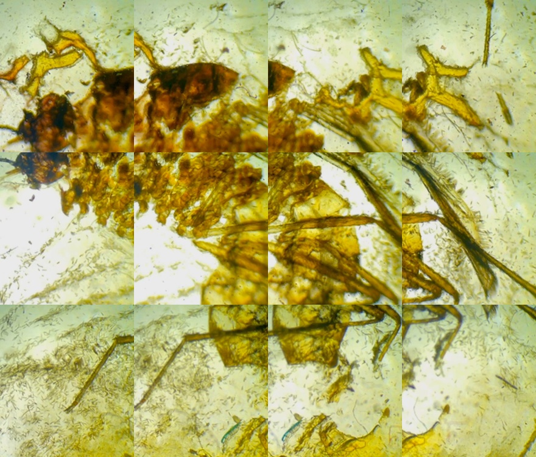
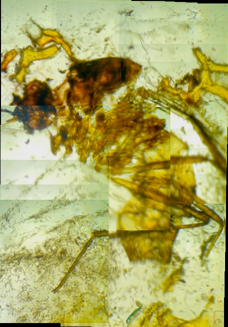
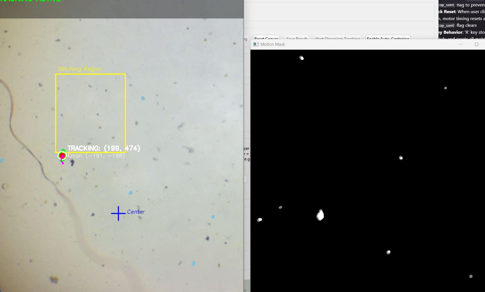
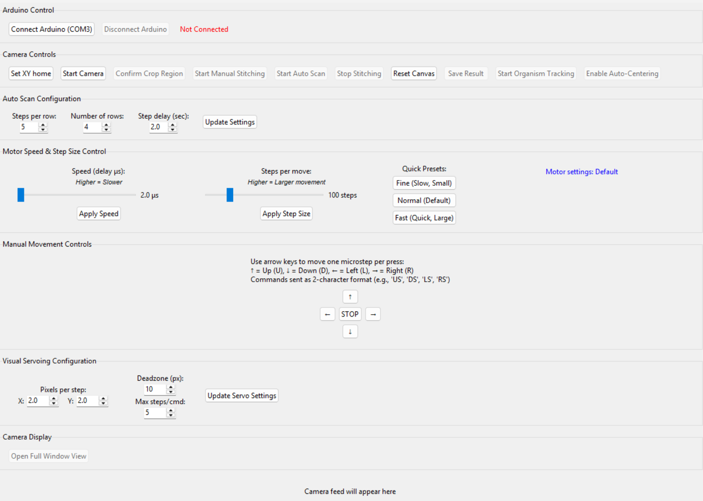

# Auto-Scope: Advanced Microscope Control & Visual Servoing System

A comprehensive Python application for automated microscope control featuring real-time organism tracking, visual servoing, intelligent motor control, and advanced image stitching. Built with ESP8266/Arduino stepper motor control and computer vision-based organism tracking.

## NEW Major Features (scroll down for photos)

### Visual & Organism Tracking
- **Real-time Organism Detection**: Advanced computer vision using background subtraction and contour analysis
- **Click-to-Track Interface**: Simply click on any moving organism to automatically track it
- **Intelligent Motor Control**: Stage automatically moves to keep tracked organisms centered in view
- **Full Camera View Tracking**: Uses entire camera field of view (not just stitching crop region)
- **Anti-Spam Motor Control**: Smart 3-second intervals prevent erratic movement
- **Independent Axis Control**: Only moves axes with significant error (>30px threshold)
- **Thread-Safe Operation**: Robust threading prevents GUI conflicts and crashes

### Advanced Motor Control
- **Configurable Speed & Step Size**: Real-time adjustment of motor parameters
- **Preset Movement Profiles**: Fine, Normal, and Fast movement presets
- **Boundary Protection**: Prevents movement beyond set limits when home is established
- **Rate Limiting**: Prevents Arduino overload with intelligent command spacing
- **Emergency Stop**: Immediate motor stop on tracking loss or manual reset
- **Position Tracking**: Real-time absolute position display with coordinate system

### Enhanced Image Processing
- **Live Image Stitching**: Smooth blending algorithm for seamless panoramic images
- **Automated Lawnmower Scanning**: Configurable grid patterns for systematic area coverage
- **Crop Region Management**: Separate regions for stitching vs. tracking operations
- **Real-time Preview**: Live preview of stitched results during capture
- **Multiple View Modes**: Small tile view and full-window camera display options

### Improved User Interface
- **Dual Camera Views**: Small tile view for monitoring + full-window view for detailed work
- **Visual Feedback**: Frame center crosshairs, error displays, and status overlays
- **Start/Stop Toggle**: Easy restart of tracking system without application restart
- **Real-time Status**: Live motor status, position tracking, and system feedback
- **Keyboard Shortcuts**: Arrow keys for manual control, hotkeys for tracking functions

## Hardware Requirements

- **Camera**: USB microscope (configurable camera index, default: 1)
- **Arduino**: ESP8266 or Arduino Uno connected via USB (COM3, 115200 baud)
- **Motors**: XY motorized stage with stepper motor control
- **Stage**: Microscope stage with Arduino-controlled movement system

## Installation

1. **Clone the repository**:
```bash
git clone https://github.com/genecodAlan/auto-scope.git
cd auto-scope
```

2. **Install Python dependencies**:
```bash
pip install -r requirements.txt
```

3. **Program Arduino**: Upload the provided Arduino sketch to your ESP8266/Arduino
4. **Connect Hardware**: Ensure Arduino is connected to COM3 and motors are wired correctly

##  Usage Guide

### Quick Start
```bash
python micro_camera_scope/main_control.py
```

### Step-by-Step Operation

#### 1. **System Setup**
- Click **"Connect Arduino (COM3)"** to establish motor communication
- Click **"Set XY Home"** to establish coordinate origin (enables boundary protection)
- Click **"Start Camera"** to initialize video feed

#### 2. **Camera Configuration**
- Adjust crop region by dragging the green rectangle in the setup window
- Click **"Confirm Crop Region"** to finalize the stitching area
- Use **"Open Full Window View"** for detailed camera monitoring

#### 3. **Manual Stage Control**
- **Arrow Keys**: Move stage one step at a time (U/D/L/R commands)
- **GUI Buttons**: Click directional buttons for precise movement
- **Speed Control**: Adjust motor speed (500-20,000 μs delay)
- **Step Size**: Configure steps per movement (1-500 steps)
- **Presets**: Use Fine/Normal/Fast movement profiles

#### 4. **Organism Tracking & Visual Servoing**
- Click **"Start Organism Tracking"** to open full-size tracking windows
- **Click on any moving organism** in the camera view to begin tracking
- Press **'T'** to toggle auto-centering (motors will automatically center the organism)
- Press **'R'** to reset tracking and select a new organism
- Press **'Q'** to quit tracking mode

#### 5. **Automated Scanning**
- Configure scan parameters:
  - **Steps per row**: 2-20 horizontal movements
  - **Number of rows**: 2-10 vertical scan lines
  - **Step delay**: 0.5-5.0 seconds between movements
- Click **"Start Auto Scan"** for automated lawnmower pattern scanning
- System automatically captures and stitches images during scan

#### 6. **Image Stitching**
- Click **"Start Manual Stitching"** for real-time stitching during manual movement
- Live preview window shows stitching progress
- **"Reset Canvas"** to start fresh stitching session
- **"Save Result"** to export final stitched image

## ⚙️ Advanced Configuration

### Motor Control Parameters
```python
# Visual Servoing Settings
DEADZONE = 50              # Pixels - minimum error before movement
AXIS_THRESHOLD = 30        # Pixels - minimum error per axis
MOTOR_COMMAND_INTERVAL = 3.0  # Seconds between motor commands
PIXELS_PER_STEP_X = 2.0    # Calibration constant for X-axis
PIXELS_PER_STEP_Y = 2.0    # Calibration constant for Y-axis
```

### Arduino Communication Protocol
- **2-Character Commands**: `"UR"` (Up+Right), `"SL"` (Stop+Left), `"SS"` (Stop+Stop)
- **Configuration Commands**: `"SPEED:4000"`, `"STEPS:100"`, `"STATUS"`
- **Response Format**: `"MOVE_OK:x,y"`, `"SPEED_SET:4000"`

### Tracking Algorithm Details
- **Background Subtraction**: MOG2 algorithm for motion detection
- **Contour Filtering**: Area-based filtering (50-3000 pixels)
- **Centroid Tracking**: Moment-based center calculation
- **Jump Detection**: Maximum 100-pixel movement between frames
- **Trail Visualization**: 50-frame history with fade effect

## Key Improvements & Features

### Visual Servoing System
- **Error-Based Control**: Computes pixel error and converts to motor steps
- **Independent Axis Movement**: X and Y axes move independently based on error magnitude
- **Smart Thresholds**: Prevents jittery movement with configurable deadzone
- **Rate Limiting**: 3-second intervals prevent motor spam and allow settling time
- **Safety Stops**: Immediate motor stop on tracking loss or system shutdown

### Threading & Performance
- **Thread-Safe Design**: Separate threads for camera capture, display, and motor control
- **No GUI Blocking**: Background processing doesn't freeze user interface
- **Memory Management**: Efficient frame queues with size limits
- **Error Recovery**: Robust error handling and automatic recovery

### User Experience
- **Visual Feedback**: Real-time error display, frame center indicators, status overlays
- **Restart Capability**: Can stop and restart tracking without application restart
- **Keyboard Controls**: Intuitive hotkeys for all major functions
- **Status Messages**: Clear feedback for all operations and error conditions

## Project Structure

```
auto-scope/
├── micro_camera_scope/
│   ├── main_control.py              # Main application entry point
│   ├── visual_servo_tracker.py      # Visual servoing and tracking logic
│   ├── utilities/
│   │   ├── tracking.py              # Basic tracking algorithms
│   │   ├── click_proxy.py           # Interactive organism selection
│   │   └── global_track.py          # Global tracking utilities
│   └── arduino_versions/
│       └── arduino_main.ino         # Arduino firmware for motor control
├── tests/
│   ├── test_visual_servoing.py      # Visual servoing tests
│   ├── test_camera_simple.py        # Camera functionality tests
│   └── test_setup.py                # System setup tests
├── colony_counting/
│   └── colony_counter.py            # Colony counting utilities
├── captured_images/                 # Auto-saved frame captures
├── demo_images/                     # Example outputs and screenshots
├── archive_old_versions/            # Previous versions and backups
├── requirements.txt                 # Python dependencies
└── README.md                        # This comprehensive guide
```

## 🖼️ Example Outputs

### Automated Grid Stitching

*Florida mosquito slide prep at 100X magnification - automated grid scan*

### Manual Stitching Results

*Florida mosquito slide prep at 100X magnification - manual stitching with ORB feature matching*

### Real-Time Organism Tracking

*Live organism tracking with visual servoing - green contours show detected organisms, crosshair shows frame center*

### User Interface

*Complete control interface with motor controls, tracking options, and real-time status*

## 🔧 Troubleshooting

### Common Issues

**Camera Problems**:
- `Camera not found`: Check camera index in code (default: 1)
- `Cannot read frames`: Verify camera permissions and USB connection
- `Poor tracking`: Adjust lighting and ensure good contrast

**Arduino Communication**:
- `Connection failed`: Verify COM port (default: COM3) and baud rate (115200)
- `Commands not working`: Check Arduino firmware upload and wiring
- `Motor not moving`: Verify stepper motor connections and power supply

**Tracking Issues**:
- `No organisms detected`: Ensure good lighting and moving objects in view
- `Erratic movement`: Increase deadzone or axis threshold values
- `Tracking lost`: Click on organism again or press 'R' to reset

**Performance Issues**:
- `Slow startup`: TensorFlow imports removed for faster initialization
- `GUI freezing`: Threading improvements prevent interface blocking
- `Memory usage`: Frame queues automatically manage memory usage

### Advanced Troubleshooting

**Motor Control Debugging**:
```python
# Enable debug output in visual_servo_tracker.py
DEBUG_MOTOR_COMMANDS = True

# Check Arduino response
# Send "STATUS" command to get current motor settings
```

**Camera Calibration**:
```python
# Adjust calibration constants in main_control.py
PIXELS_PER_STEP_X = 2.0  # Increase if stage moves too little
PIXELS_PER_STEP_Y = 2.0  # Decrease if stage moves too much
```

## Contributing

1. Fork the repository
2. Create a feature branch (`git checkout -b feature/amazing-feature`)
3. Commit your changes (`git commit -m 'Add amazing feature'`)
4. Push to the branch (`git push origin feature/amazing-feature`)
5. Open a Pull Request

## License

This project is licensed under the MIT License - see the LICENSE file for details.

## Acknowledgments

- OpenCV community for computer vision algorithms
- Arduino community for motor control examples
- Python scientific computing ecosystem (NumPy, PIL, Tkinter)

## Support

For questions, issues, or contributions, please open an issue on GitHub or contact Alan (me).

---

**Auto-Scope** - Merging automation and AI with microscopy.

